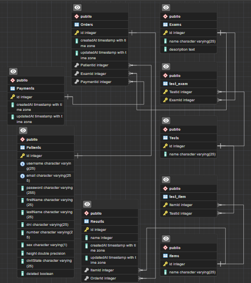

# Schema



Desactualizada

# Routes

``` GET /patients ``` devuelve todos los pacientes activos

``` POST /patients/login ``` ruta de login para pacientes

``` POST /patients/signup ``` ruta de signup para pacientes

``` DELETE /patients ``` elimina al paciente

``` GET /tests ``` devuelve todos los tests

``` GET /tests/?search=sangre ``` devuelve los test que coinciden por nombre o descripcion

``` GET /tests/:id ``` devuelve los detalles de el test

``` GET /samples ``` devuelve todos los tipos de muestras

``` GET /categories ``` devuelve todas las categorias

``` GET /orders ``` devuelve las ordenes del paciente

``` GET /orders/all ``` devuelve todas las ordenes

``` GET /results/:id ``` devuelve los resultados de la orden

``` GET /doctors ``` devuelve los doctores